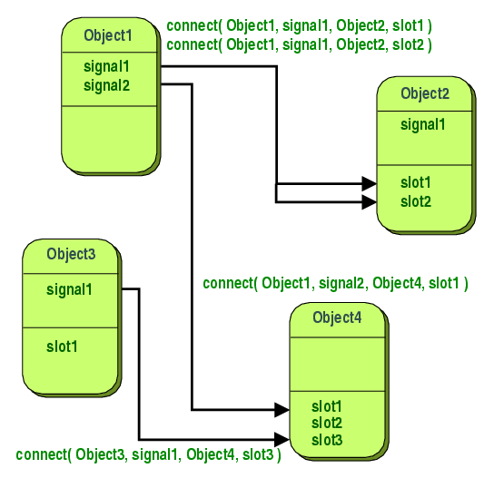

# 写在前面

本文主要介绍Qt信号槽(signal and slot)机制，介绍Qt信号槽机制的含义，用途以及如何简单的使用。本文基于Qt5，大部分内容来源于其文档，文档链接[在此](https://doc.qt.io/qt-5/signalsandslots.html)

# 为什么要使用信号槽机制

Qt是一种基于C++的GUI(graphic user inferface)工具库，而在GUI应用中，涉及到人机交互，也就是程序需要对用户的各种操作进行响应，这个需求本质上就是GUI编程中的控件之间的通信问题。基于Qt的GUI程序存在着大量的控件，如按钮，标签，候选框等，这些控件在编程层面也就是以对象形式存在，因此这样控件间的通信问题实际上就是对象间的通信问题。好了，在Qt中使用的是信号槽机制实现对象间的通信问题，而在其他的GUI工具库使用称为回调(callback)的机制。

# Qt信号槽机制的构成
在Qt中，一个对象可以向另一个对象发送信号， 一个对象可以使用槽接收其他对象发送的信号，示意图如下：
通过使用connect操作，将一个对象的信号与另一个对象的槽构建联系，即对象的信号发出将会被另一个对象的槽接收，并且进行设定的操作。
## 信号(Signal)
信号定义在Qt对象中，可以使用关键词`emit`发射信号，一旦信号发出，与之相连接的槽会立即执行对应操作。信号在对象中通常是公开可访问的，因此可以在任何地方发射。`需注意的是使用`emit`发射信号时，一般会立即触发连接槽对应的操作，因此只有当所有与该信号相关的槽都产生了返回才会进行执行`emit`后面的语句`，不过这个行为与信号与槽的连接方式有关，可参考[如下链接](https://doc.qt.io/qt-5/qt.html#ConnectionType-enum)。

在Qt中，默认定义了很多信号，而不需要我们考虑。MOC（meta-object compiler）会对用户编写的`.cpp`文件进行扫描处理，生成包含Qt内容的`.cpp`文件。

## 槽(Slot)
槽在Qt对象中定义为函数，当所连接的信号发出时，槽函数会立即被调用，由于槽函数也是定义为C++函数，因此可以也直接调用。在C++定义中，一般使用关键词`slots`声明Qt对象包含的槽函数。

# Qt信号槽机制的使用

在实践中，我们如果想要使用Qt的信号槽机制就需要按照Qt的语法规范进行编程。在自定义的对象中，我们除了需要继承`QObject`之外，还需要在对象定义中使用关键词`Q_OBJECT`。因为Qt会使用MOC对所有编写的源文件进行扫描，只有包含`Q_OBJECT`的自定义对象才会有Qt提供的各种功能。一个类似的对象定义如下：
```C++
#include <QObject>

class Counter : public QObject
{
    Q_OBJECT

public:
    Counter() { m_value = 0; }
    // 以下成员函数是const的特殊用法，表示该成员函数不能对类的数据成员进行修改。
    int value() const { return m_value; }
// 使用关键词slots表示该对象存在的槽函数，槽函数可以直接调用也可以通过信号触发
public slots:
    void setValue(int value);
// 使用关键词signals表示该对象可发射的信号，类似于一个函数声明，参数表示信号发射时将给槽提供的参数。
signals:
    void valueChanged(int newValue);

private:
    int m_value;
};
```
在类对象的定义中，槽函数是需要我们自己编程实现的，而信号那块不需要我们考虑。
```C++
void Counter::setValue(int value)
{
    if (value != m_value) {
        m_value = value;
        // 使用关键词emit发射信号
        emit valueChanged(value);
    }
}
```
在完成对象的定义后，槽函数及信号都已经存在，接下来就是需要根据我们的需要将信号和槽进行连接，使用`connect`进行连接，一个示例如下：
```C++
Counter a, b;
QObject::connect(&a, &Counter::valueChanged,
                 &b, &Counter::setValue);

a.setValue(12);     // a.value() == 12, b.value() == 12
b.setValue(48);     // a.value() == 12, b.value() == 48
```
将信号与槽进行连接后，如果信号发出，则对应的槽函数将被调用。在上述示例中，对象`a`设置值后会发出`valueChanged`的信号，这会导致对象`b`中的槽函数触发，而对象`b`的信号虽然发出，但是并没有与对象`b`中的槽函数进行连接，因此对象`a`中槽函数不会被触发。

# 最后
我们知道在Qt中使用的是信号槽机制进行对象间的通信，因此如果有对象间通信的需求，可以依据Qt约定的规范进行编程。信号与槽的连接是基本的一步，但是在实际运用中我们可能会遇到信号槽连接的高级运用或者不同类型的连接，这些高级用法仍然是在基本的概念上进行的，在构建基本的认识后，可以慢慢分析一些高级用法的原理。