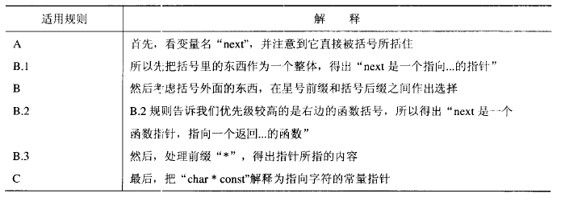
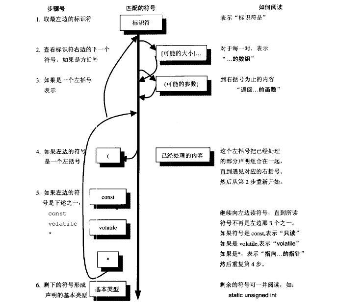

# 一. 你真的清楚C中声明语句的规则及解读方式吗？
学过C语言的同学应该都知道，对于变量我们需要声明之后才能使用，如使用整型变量 **int a** 或使用整型数组 **int a[4]** ，对于函数我们有时候也需要声明之后才能调用,如声明返回整型且参数为整型的函数 **int func(int)**，甚至涉及到强制类型转换时我们有时候也需要理解声明才能准确判断, 如将指针强制转换成函数指针 **(void (\*)()) a** 。但是你有真的理解声明吗，声明语句应该有那些部分呢，怎么样的去解读复杂的声明语句呢，如 **void (\*signal(int sig, void (\*func)(int)))(int)** 呢？ 
# 二.基础知识回顾
在我们着手去介绍规则之前,我们先回顾一下C语言的一些基础,毕竟温故而知新呀.
* **标识符**: 指C语言中用来标志识别某个对象的符号,可以作为变量名,数组名,函数名,标号及自定义对象的名称
* **关键字**: 用来表示C语言本身具有的成分,具有特殊的语义.其中以下几类与声明密切相关.
  1. 类型说明符(type-specifier): 用于指定声明对象类型.`void, char, short, int, long, signed, unsigned,float, double`以及结构说明符`struct`, 枚举说明符`enum`, 联合说明符`union`.
  2. 存储类型标识符(storage-class): `extern, static, register, auto`.
  3. 类型限定符(type-qualifier): `const, volatile`.
* 与声明相关的运算符优先级: () 及 [] 优先级最高,且自左至右进行结合; 类型转换(t) 及 * 优先级第二级,自右至左进行结合
* **声明器**: 声明器就是标识符或者和他组合在一起的任何指针,函数括号,数组下标等,是声明语句中的重要部分.C语言中声明器由如下表格内容:

  | 数量 | C语言中名字 | C语言中出现形式 |
  | ----- | ----- | ----- |
  | 零个或多个 | 指针 | 下列形式中的一种:   `* const volatile`   `* volatile`   `*`   `* const`   `* volatile const` |
  | 有且只有一个 | 直接声明器 | 以下形式中的一种:   **标识符**   或: **标识符[下标]...**   或:**标识符(参数)**   或: **(声明器)** |
  | 零个或一个 | 初始化内容 | = 初始值 |

  声明器例子: `foo, (*foo), *const foo, foo(), *foo[]` 等等 
  注意: 一个声明器最终由表格上的各部分按数量组成,其中注意直接声明器那一部分, **标识符[下标]...** 中省略号表示方括号可能不止一个.
# 三.C语言中声明语句的成分
C语言中声明确定变量类型及初值,其语句成分如下:

| 数量 | C语言中名字 | C语言中出现形式 |
| ----- | ----- | ----- |
| 至少一个类型说明符 | 类型说明符   存储类型标识符   类型限定符 | [见以上定义](#二.基础知识回顾) |
| 有且只有一个 | 声明器 | 见以上定义 |
| 零个或多个 | 更多的声明器 | , 声明器 |
| 一个 | 分号 | ; |

声明语句例子: `static int *foo;` 或 `const int *foo, *foo[2]` 等等 
一条声明语句由以上部分组成,但是我们应该知道有些组合是非法,而有些是合法的.
* 函数不能返回函数或数组, `foo()()`或`foo()[]`非法.
* 数组中不能包含函数, `foo`非法.
* 函数可返回指针,数组可以包含函数指针,数组也可以包含其他数组.
# 四.声明的规则及解读方式
对于C语言声明语句的解读,我们应当依据循序渐进的方式进行理解,通过一步步的解读来解析声明的内容,不过在具体解读之前,我们先看看理解C语言声明的优先级规则:

| C语言声明的优先级规则 |
| --- |
| A. 声明应先从最左边的标识符开始读取,然后按照优先级顺序读取. |
| B. 优先级从高至低:    &emsp; B.1 声明中被括号括起来的部分   &emsp; B.2 后缀操作符:   &emsp; &emsp; 括号()表示这是一个函数   &emsp; &emsp; 方括号[]表示这是一个数组   &emsp; B.3 前缀操作符: 星号*表示指向...的指针 |
| C. 如果`const`或`volatile`关键字的后面紧跟类型说明符,那么它们作用于类型说明符,在其他情况下,`const`或`volatile`关键字作用于它左边的指针星号,表示指针是常量,如果左边是类型说明符也表示作用于类型说明符 |

我们以一例声明进行分析: `char * const *(*next)()`

声明解读的过程如下图示:

# 五.问题的解决
在介绍完声明解读规则后,我们以文章开头的例子进行解析: `void (*signal(int sig, void (*func)(int)))(int);`

| 剩余的声明 | 采取的步骤 | 结果 |
|--- | --- | --- |
| `void (*signal(int sig, void (*func)(int)))(int);` | 第1步 | 从最左边标识符开始, `signal`是... |
| `void (*` &emsp; &emsp; &emsp;` (int sig, void (*func)(int)))(int);` | 第2步 | 不匹配,进入下一步,表示`signal`是... |
| `void (*`  &emsp; &emsp; &emsp; `(int sig, void (*func)(int)))(int);` | 第3步 | 与括号匹配, 括号内为参数, 所以`signal`是返回...的函数 |
| `void (* `  &emsp; &emsp; &emsp; &emsp; &emsp; &emsp; &emsp; &emsp; &emsp; &emsp; &emsp; &emsp; &emsp; &emsp; &emsp; &emsp; &emsp;  `)(int);` | 第4步 | 不匹配,表示`signal`是返回...的函数 |
| `void (*`  &emsp; &emsp; &emsp; &emsp; &emsp; &emsp; &emsp; &emsp; &emsp; &emsp; &emsp; &emsp; &emsp; &emsp; &emsp; &emsp; &emsp;  `)(int);` | 第5步 | 与星号匹配,表示`signal`是返回指针的函数,该指针指向... |
| `void (` &emsp; &emsp; &emsp; &emsp; &emsp; &emsp; &emsp; &emsp; &emsp; &emsp; &emsp; &emsp; &emsp; &emsp; &emsp; &emsp; &emsp;   `)(int);` | 第4步 | 与"("匹配, 转入第2步 |
| `void` &emsp; &emsp; &emsp; &emsp; &emsp; &emsp; &emsp; &emsp; &emsp; &emsp; &emsp; &emsp; &emsp; &emsp; &emsp; &emsp; &emsp; &emsp; `(int);` | 第2步 | 步匹配,下一步 |
| `void` &emsp; &emsp; &emsp; &emsp; &emsp; &emsp; &emsp; &emsp; &emsp; &emsp; &emsp; &emsp; &emsp; &emsp; &emsp; &emsp; &emsp; &emsp; `(int);` | 第3步 | 与括号匹配, 表示`signal`是返回指针的函数,该指针指向返回...的函数 |
| `void` &emsp; &emsp; &emsp; &emsp; &emsp; &emsp; &emsp; &emsp; &emsp; &emsp; &emsp; &emsp; &emsp; &emsp; &emsp; &emsp; &emsp; &emsp; &emsp; &emsp; `;` | 第4步,第5步 | 都不匹配 |
| `void` &emsp; &emsp; &emsp; &emsp; &emsp; &emsp; &emsp; &emsp; &emsp; &emsp; &emsp; &emsp; &emsp; &emsp; &emsp; &emsp; &emsp; &emsp; &emsp; &emsp; `;` | 第6步 | 表示无类型 |

对于函数的参数,我们可以同理解读,所以最后串起来读作: `signal`是返回函数指针的函数,该函数接受`int`及函数指针为参数,返回的函数指针指向无返回值的函数,该函数接受`int`参数.
# 六.总结
在我们了解声明的规则及解读过程后,我想对于声明的理解可以更上一层楼了.在解读声明时最重要的循序渐进,一点点抽丝剥茧将声明的内容展开,我想用这中方法,再难的声明也会变得清晰明了.
## 参考文献
<C专家编程>

