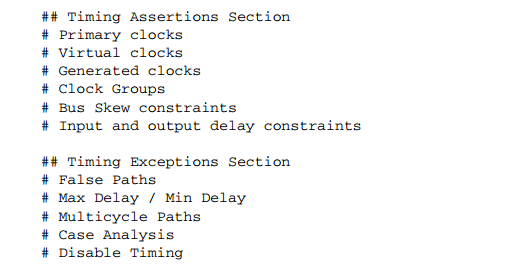
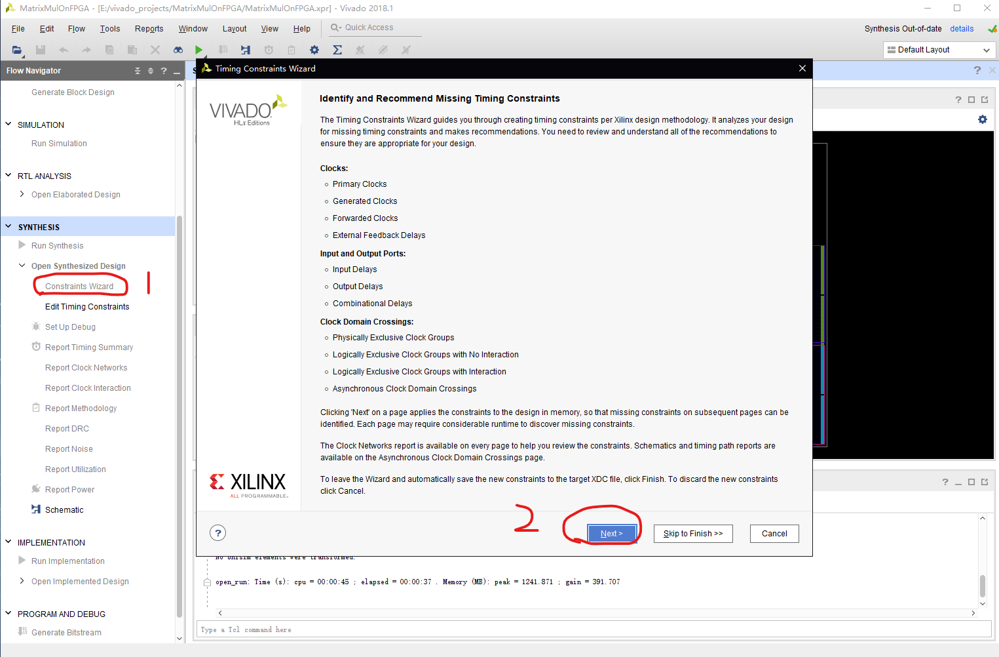

# 为什么我们需要约束文件

我想有些刚学习FPGA的同学，或多或少会对约束文件有些疑惑，约束文件包含什么内容，约束的目的是什么。那我先谈谈自己对于约束文件的理解。在我看来约束文件有主要以下两个目的：

* 清晰确定电路设计中涉及的时钟信号以及为进行电路的时序分析做准备
    我们知道现在的电路自动化设计主要仍是同步时序逻辑，但是也不乏有其他多种时钟混合使用，这个时候需要一个明确的约束告诉你的EDA工具哪个信号对应哪种时钟，工作频率如何。而知道这些内容的主要目的，一是为时序分析提供信息，二是综合与布局布线的需要。

* 明确综合后的电路在FPGA上的物理对应关系
    这一部分主要是在implementation，即布局布线阶段发挥作用。因为经过综合后，虽然已经有电路结构了，但是要将电路放在FPGA上的话需要给出电路各端口与FPGA上引脚的对应关系。

# 约束文件包含哪些内容

从上面约束文件的用途中，我们不难看出约束文件包含哪些内容：1.时序相关；2.物理约束相关。

## 时序相关约束

在Vivado中，推荐的时序约束内容如下：

其中使用较多的是primary clock(主时钟)， virtual clock（虚拟时钟），以及input and output delay（输入输出延时）。如果自己设计时不太清楚哪些需要的话，可以使用Vivado内置的Timing Constraints Wizard（时序约束向导），可以给设计者提供提示。
具体各约束内容的命令可以自己根据需要查阅官方文档

## 物理相关约束

在Vivado中，物理约束主要包含设计电路的各端口与FPGA引脚IO的映射以及，IO标准的约束。
主要使用以下语句：
* ``set_property <property> <value> <object list>``

例如：
```
set_property PACKAGE_PIN W19 [get_ports out]      # 表示布局时，将信号out与FPGA的引脚W9构建映射
set_property IOSTANDRAD LVCMOS33 [get_ports out]  # 表示布局时，将信号out对应的引脚IO标准设置为LVCMOS33
```

# 总结

以上为Vivado中的约束文件入门使用的介绍，在基本的使用中可以满足要求，当然，约束文件还有很多很多的高级使用没有介绍，以上只是为了让大家建立一个基本概念，更多的内容可以根据自己的需求去具体查阅文档，我想当你对约束文件有了大致理解后，根据需要获取信息便会更加清晰。
