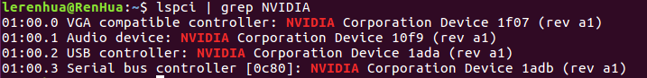
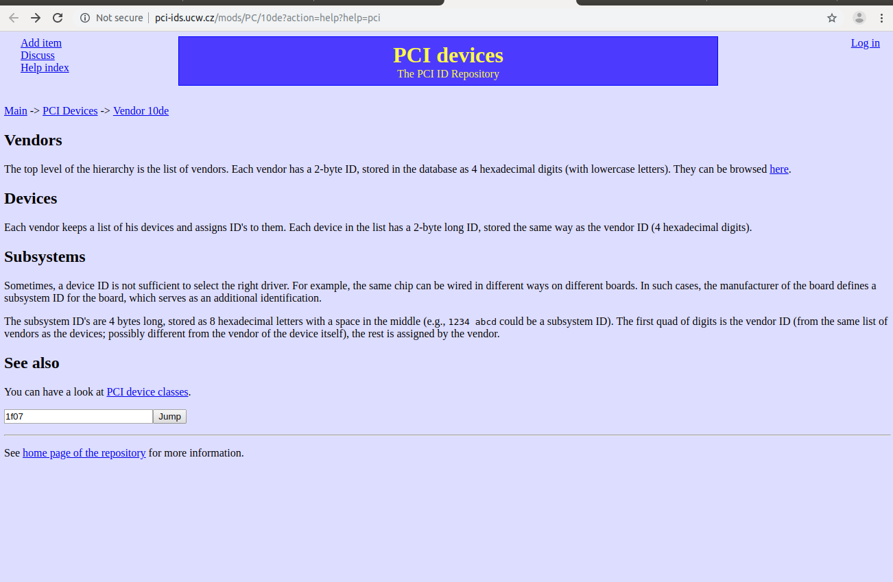
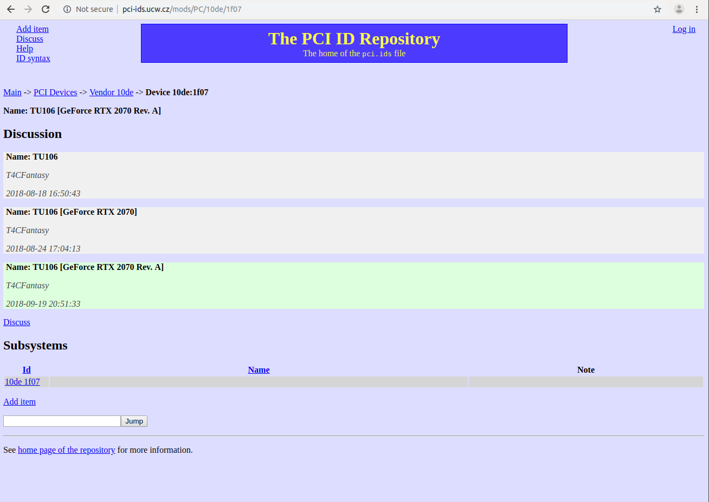
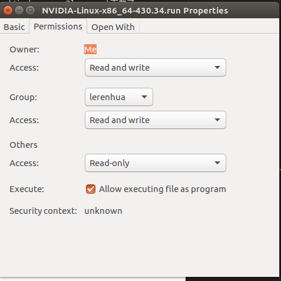
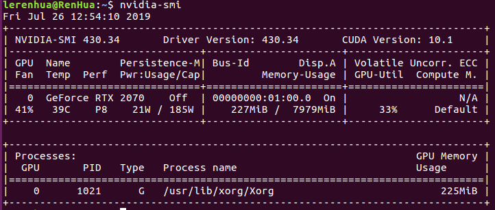

近期，在Ubuntu16.04系统上安装Nvidia显卡驱动遇到许多问题，自己也在网上找了很多，但是都是方方面面不够全面，存在许多坑及问题，特此做个记录。
# Ubuntu16.04下Nvidia显卡安装的大致流程
我觉得在安装驱动前应该好好理清驱动安装的逻辑，我觉得这样会对于处理驱动问题有个较好的理解。
## 如何理解驱动
* 驱动是将硬件抽象出来的第一层软件，只有给硬件添加驱动，操作系统才能以统一的方式对硬件进行访问，所以对于驱动其对硬件的依赖极强
，也就是说驱动软件与硬件有一丝不匹配，最终都显示无法正常工作，所以安装显卡驱动时，驱动的版本十分重要！这也与我遇到的一个问题相关，下文将提及。
## 集成显卡与独立显卡
* 集成显卡一般都是集成至主板，没有显存，但是会使用内存。因为有集成显卡的存在，所以即使不使用独立显卡，如Nvidia系列GPU，也能正常显示和使用，但成也萧何败也萧何，正因为集成显卡的存在，当你为Nvidia显卡装驱动时有各种问题发生
* Nvidia显卡是独立显卡，同时我们要意识到Nvidia驱动是不开源的，Ubuntu系统中集成的可以驱动Nvidia显卡的是第三方开源软件nouveau，这个软件并不能很好的驱动Nvidia显卡，同时在安装的正版Nvidia显卡驱动时，还会影响最终驱动安装的成功与否，所以这也是我们在安装Nvidia显卡驱动时应该实现禁用nouveau的理由。
# Ubuntu16.04下Nvidia显卡安装步骤
## 1.禁用nouveau驱动
有些教程中是第一步使用 `sudo apt-get update` 更新系统的软件依赖，我觉得这个可加可不加，我们的主要问题应该是首先清除系统自带nouveau驱动。
* 首先检查nouveau驱动是否被内核加载
```
// 一般在没有禁用之前，输入下列会输出结果
lsmod | grep nouveau
```
* 將nouveau加入黑名单
```
sudo vim /etc/modprobe.d/blacklist.conf
// 將blacklist nouveau加入文件最后
// 插曲：对于刚安装的Ubuntu系统可能没有默认自带vim，可以使用命令 sudo apt-get install vim 进行安装

// 更新一下内核
sudo update-initramfs -u
// 更新内核后需重启电脑！

// 再次检查nouveau是否被禁用
lsmod | grep nouveau
// 此时应当没有任何输出结果
```
注意： 如果检查nouveau驱动的那条命令仍然有输出，那么你应当是遇到特殊情况了，可以通过删除nouveau.ko及nouveau.ko.org文件的方法禁用nouveau，命令如下：
```
// 注意4.8.0-36-generic是你安装的系统对应的内核
cd /lib/modules/4.8.0-36-generic/kernel/drivers/gpu/drm/nouveau
sudo rm -rf nouveau.ko
sudo rm -rf nouveau.ko.org
// 之后再更新一下内核，并检查nouveau是否禁用
```
## 2.下载Nvidia显卡驱动
在完成第一步禁用nouveau驱动后，我们现在可以知道作为独立显卡的Nvidia显卡已经没有驱动软件了，即不会被处理器调用进行显示工作，现在电脑的显示是调用主机的集成显卡来完成的。所以我们剩下的工作也比较明确就是安装对应打驱动软件，使得处理器可以调用Nvidia显卡完成显示工作。此处我们使用手动下载Nvidia显卡驱动软件来完成之后的工作，至于另一种使用PPA源的方法，我们放在之后讨论其问题。
* 查询Nvidia对应型号<br>
查询显卡型号是为了去官网下载合适的驱动软件，其中有两种方法可以查询：
1. 直接看显卡上有没有型号相关的信息，把型号记下来
2. 如果你的显卡已经装配到主机箱里面了，拆开也不太方便，那可以在Ubunutu系统中进行查询
```
// 输入命令查询Nvidia显卡型号
lspci | grep NVIDIA
```
输出结果如下：

第一行即包含Nvidia显卡型号。不过应当注意有些可以输出具体型号如GeForce RTX 2070,有些时候只会输出PCI编号，如上图中显卡PCI ID为1f07，对于这种情况也不用着急，去这个[网站](http://pci-ids.ucw.cz/mods/PC/10de?action=help?help=pci)查询即可。


* OK! 现在我们已经知道了显卡型号，这样可以直接去[Nvidia官网](https://www.nvidia.cn/Download/index.aspx?lang=cn)下载了。
* 我们从官网下载的驱动软件是.run文件，本身是不能直接运行的需要修改属性。右击下载好的驱动文件，进入属性
<br>
勾选 `可以作为可执行文件打选项`即可
## 3.安装Nvidia显卡驱动软件
现在进行最后一步的驱动安装，按照步骤来即可
* 卸载之前安装打Nvidia驱动
```
// 如果之前没安装过驱动可跳过
sudo apt-get remove --purge nvidia-*
```
* 按Ctrl+Alt+F1进行命令行界面，然后输入命令关闭图形界面
```
sudo service lightdm stop
```
* 进行驱动文件所在目录，运行驱动文件
```
sudo ./NVIDIA-Linux-x86_64-384.90.run –no-x-check –no-nouveau-check –no-opengl-files
```
注意：一定要带这些参数！！！
```
含义如下：
–no-x-check：安装驱动时关闭X服务
–no-nouveau-check： 安装驱动时禁用nouveau
–no-opengl-files： 只安装驱动文件，不安装OpenGL文件
```
## 4.检查驱动是否安装成功
检查驱动是否成功，这一步非常重要！！！
```
// 运行命令检查驱动
nvidia-smi
```
如果运行命令后输出结果如下，则驱动安装成功！

否则，驱动安装失败！注意注意！驱动安装失败后一定要先卸载运行命令卸载刚刚安装的驱动
```
sudo apt-get remove --purge nvidia-*
```
如果未卸载则会出现两种情况：
```
1.如果你是Ubuntu引导的双系统，那么重启进入Ubuntu后会黑屏，且有光标闪烁。在我看来这是因为安装完驱动后，处理器不调用集成显卡而开始调用Nvidia显卡进行工作，但是驱动是安装不成功的，也就意味着处理器不能成功使用显卡，所以结果无法正常显示。
2.如果你是其他系统引导的双系统，如win7，那么重启后无法进入Ubuntu系统。

而这两种情况都是由于驱动安装不成功引起的，这也就是我不推荐PPA源安装方法的原因，因为使用PPA源可能会安装版本不对而导致驱动安装失败打情况！
```
解决方法：重启进入BIOS设置，將安全引导开启（刚刚我们安装驱动的时候默认都是不开启安全引导的），这样Nvidia驱动就不会被ubuntu系统使用，可以重新重新进入系统了。