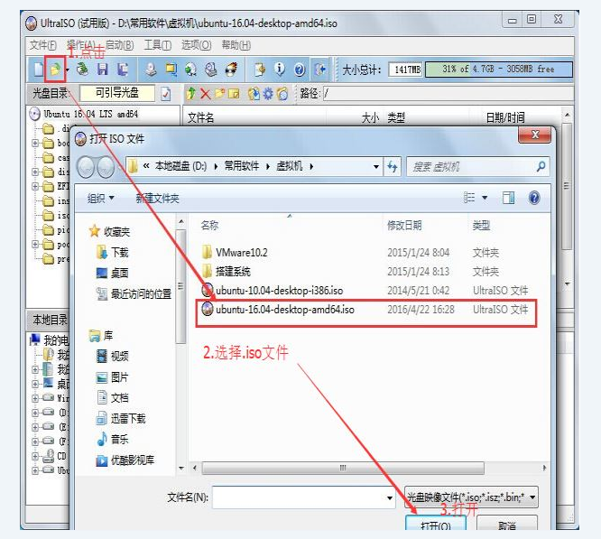
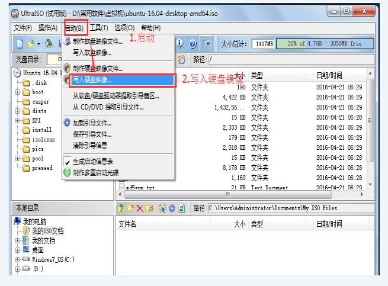
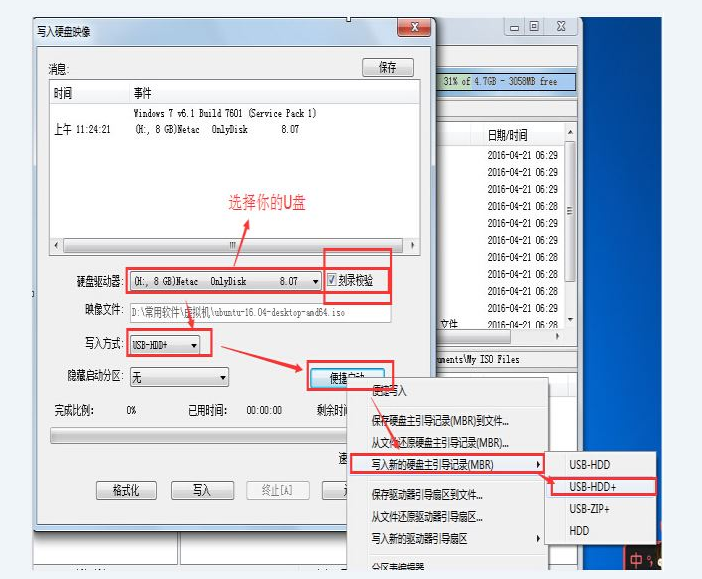

# 写在前面

此篇文章是之间自己安装Ubuntu16.04系统过程的记录,现在将发布出来以供参考还有自己以后查看.

# window7下安装ubuntu16.04系统的方法
本人比较推荐使用制作U盘启动盘的方法安装系统,而对于使用一键装机的方法其实并不太推荐,一键装机有着比较多的弊病,不如制作U盘启动盘来得干净,而且U盘启动盘的制作过程其实很简单,只要按照步骤来就行.同时在讲解步骤的时候我也会尽量把为什么这么做说说,尽量做到知其然然后知其所以然.
# window7下安装ubuntu16.04的详细过程
## 准备工作
* 一个大小合适的U盘:至少要大于5GB,因为操作系统的镜像一般在3G左右,所以大一些没毛病.同时要注意U盘里如果有重要东西要自己事先备份,因为之后制作U盘启动盘的时候会将U盘格式化!
* UltralSO软件:这是制作启动盘的重要软件,我一般用这个,给出链接:
* 下载好要安装的Ubuntu16.04操作系统的镜像: 可以去[官网](https://cn.ubuntu.com/download)看看,也可以去[清华源](https://mirrors.tuna.tsinghua.edu.cn/ubuntu-releases/16.04/)下载镜像,如果电脑配置允许，推荐下载64位系统的镜像。
## 具体过程
https://m.jb51.net/os/windows/565368.html
https://segmentfault.com/a/1190000014523888
### 1.制作U盘启动盘 
安装好UltralSO软件后接下来就可以制作启动盘了，按图进行操作即可

完成上述操作后点击写入，然后差不多要等几分钟完成后关闭软件，至此U盘启动盘做好了。

### 2.在window7系统下进行磁盘分区操作
因为操作系统需要存储在磁盘上，而初始时磁盘上只有window7系统，因此基本上磁盘都被window7占用了，所以需要在磁盘上分区，腾出空闲的磁盘空间给Ubuntu系统。

磁盘分区完成后就进入下一部分,启动盘启动完成Ubuntu初始化设置.
### 3. 启动盘设置及Ubuntu初始化设置
进入电脑的BIOS系统,这个要因电脑而异,不同厂商的BIOS系统进入有些许差异,请自行百度.需注意的是,进入BIOS系统之前需要先插入U盘,然后设置U盘为默认启动盘.完成之后就进入了Ubuntu系统初始化过程.
