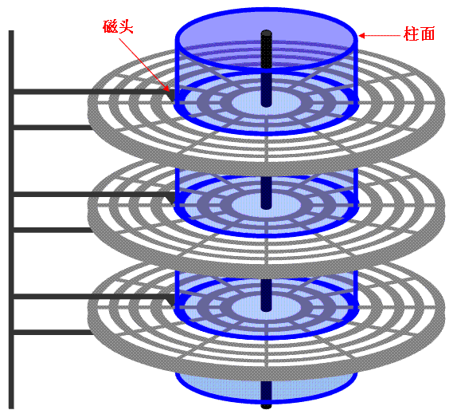

# 写在前面
我们都知道磁盘在计算机中作为存储介质发挥作用的。在磁盘上存储着大大小小各种类型的文件数据，但是磁盘上只有我们保存的文件数据吗，如果有其他的会是些什么呢？我们对文件的访问落实到物理层面对磁盘的访问会是怎么样的呢？针对这些对磁盘与文件相关的思考，在此记录学习到的内容，如有问题希望指出更正^_^

# 目录
* [1.磁盘如何存读数据](#1.磁盘如何存读数据)
* [2. 文件在磁盘是什么形式存在的](#2.文件在磁盘是什么形式存在的)
* [3. 磁盘数据布局](#3.磁盘数据布局)

# 1. 磁盘如何存读数据
首先我们需要对磁盘物理结构存在概念，其示意图如下：

对于磁盘而言其基本结构如上，主要由磁盘盘面和磁头构成。多个磁盘盘面同轴旋转。根据磁头在盘面的位置，可以将每个磁盘盘面化成同心圆环，每个圆环称为`磁道`，磁盘盘面相同位置的圆环形成磁盘`柱面`。每个磁道被划分成若干个区域，这个小区域即被称为`扇区`。扇区是磁盘读取写入的最小单元，一般为512字节，因此磁盘也称为块设备。

现在我们知道了磁盘读取写入的最小单元是扇区，每次读取或者写入都是以扇区为单位进行数据的传输，那么如何对扇区进行索引呢？从磁盘结构中我们可以很直观的看出来对扇区的索引需要三个信息，扇区是在哪个磁盘盘面，扇区是在哪个磁道上，扇区是在磁道的哪个位置，总结即是磁头，柱面，扇区。但是实际上，我们不需要三个参数量，因为磁盘控制器和驱动程序的存在，对磁盘扇区的访问只需要知道序号即可，也就是说将磁盘抽象成一个线性的设备，磁盘扇区从0开始进行编号。以一个包含100个扇区的磁盘抽象示意如下：

# 2. 文件在磁盘是什么形式存在的
在第一部分中，我们知道了对磁盘数据的读写是以扇区为单位的读出或写入。在不同的文件系统中，有时最小的数据块单元大小不一定是单个扇区，即512字节，有可能为2个扇区或8个扇区，即1KB或4KB。文件数据实际上便是以数据块为单位存储在磁盘上的。实际上文件数据对应的数据块不是连续存储的，而是随机存放，因此只需要记录每个数据块的地址就可以正常对文件读取写入。在现有的文件系统中，一般使用`i-节点`的数据结构保存文件数据块的地址，除此之外i-节点数据结构也保存了文件的很多属性信息。因此，每个文件都有对应的i-节点数据结构，对文件的访问都是通过文件对应的i-节点数据进行操作间接完成的。

# 3. 磁盘数据布局
磁盘上任意区域都是可以存放文件数据的吗？这个很明显是不行的，磁盘上的存储空间一方面是用于存储可用的文件数据，一方面需要存储其他数据，正如上一部分的i-节点数据。实际上，一块完整可用的磁盘，其具有特定的布局，示意如下：

磁盘首先需要进行分区，包含主引导记录（MBR）以及分区表，然后接下来是个分区内容。
* 主引导记录是用于启动计算机的，其中包含的程序用于确定哪个是活动分区，也就是包含操作系统的分区，将包含操作系统的分区的引导块内的引导程序读入内存。主引导记录保存在磁盘的第一个扇区，同时该扇区还保存着分区表数据。
* 每个分区都包含了引导块和超级块，其中如果该分区内包含操作系统，那么引导块内的引导程序就会将操作系统读入内存并且运行，如果分区不包含操作系统，一般为了标准统一也会预留该块空间。一般一个分区使用一种操作系统，超级块就包含了关于该分区使用的文件系统的所有关键参数，在计算机启动或者文件系统首次被使用时，超级块内容会读入内存中。
* 空闲空间管理是记录了分区中那些块被使用或者是空闲的，一般使用位图进行记录
* 索引节点即是专门用于保存i-节点数据的所留的空间，是一个数组结构，因此只需要知道对应i-节点序号即可获取对应的i-节点数据。

